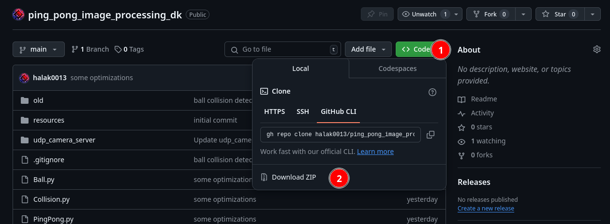
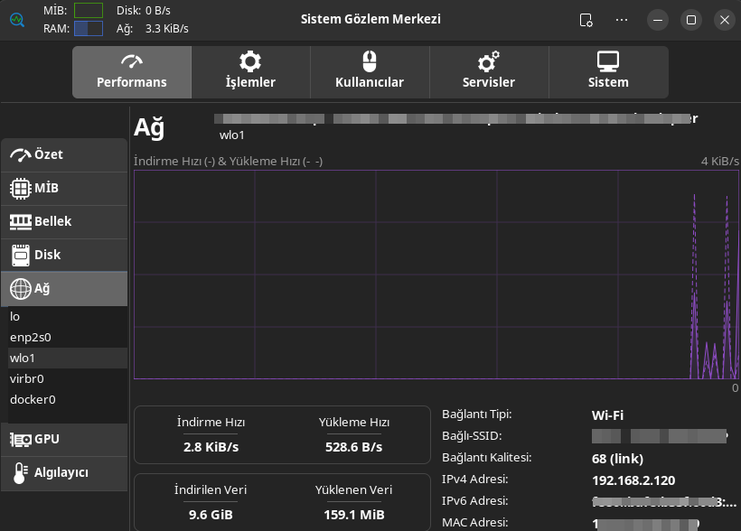
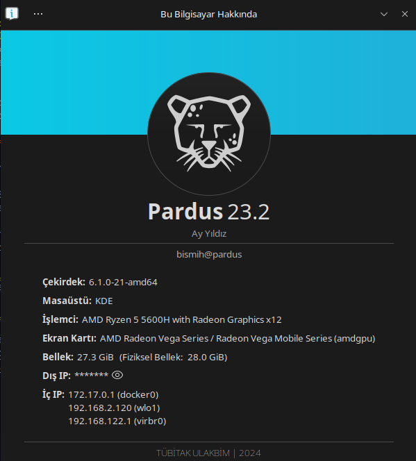
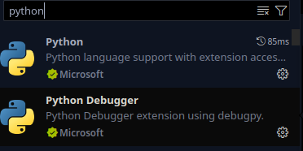
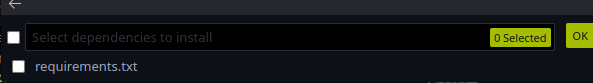

# Robot Kol Uygulaması  
Bu projemizde ellerimizi kullanarak iki kişilik pin oyunu oynayacağız.

## Uygulama nasıl kullanılacak
- Uygulamayı başlattığınız zaman 5 saniye boyunca kolunuzu hareket ettirip kolun çevresi etrafında döndürmesi için olan kalibrasyonu yapmanız gerekmektedir
- Geri kalan kısım tamamen servo motorları kod üzerinden ayarlamaya kalıyor

> Oyunu ister deneyap kartın kamerası ile ister de kendi bilgisayarınızı kamerası ile oynayabilirsiniz. Bunun için RobotArm.py kodunun sonundaki parametreyi değiştirmeniz gerekmektedir.
```python
if __name__ == "__main__":
    app = PingPong(source="camera") # source="sock" , "camera"
    app.run()
```


## Uygulamaya başlamadan önce bazı hatırlatmalar!:
- Projeyi indireceğiniz yerin yolunda Türkçe karakter ve boşluk olmaması gerekmektedir. Yoksa kütüphane bulma işleminde sıkıntı çıkmaktadır. aşağıda olmaması gereken birkaç örnek
  - /home/kullanici/TürkçeKarakter
  - /home/kullanici/yol/proje dosyası
- Ledlerin +,- bacaklarına dikkat etmek gerekmektedir(uzun(+) bacaklar kart pinlerine gelecektir)
- Sistemde python yüklü olması gerekmektedir
  - Pardus ve debian tabanlı sistemlerde otomatik gelmektedir. Gelmediyse `sudo apt install python3 python3-pip` uç birime yapıştırıp yükleyebilirsiniz.
  - Windows için mağazadan aratıp kurabilirsiniz.


## İndirme
Projeyi indirmek için github sayfasındaki Yeşil **Code** yazan kısımdan zip olarak indir tuşuna(download zip) basmanız gerekmektedir.

> Git kullananlar için direk depoyu klonlayabilirler
```console
git clone https://github.com/halak0013/ping_pong_image_processing_dk.git
```

## Yükleme aşamaları
### Deneyap Kart yüklemesi
- Deneyap karta yükleme yapmak için ilk öncelikle Arduino üzerinden **robot_arm_camera_client** projesini açmanız gerekmektedir. Sonrasında kod içinden ağ ayarlarının yapılması gerekmektedir
```c++
const char* ssid = "xxxxxxx";
const char* password = "xxxxxxx";
const char* udpAddress = "192.168.x.x";  // UDP istemcisinin IP adresi
const int udpPort = 12345;               // UDP portu
```
  - ssid -> Ağ adınız
  - password -> Ağ şifreniz
  - udpAddress -> Bilgisayarınızın yerel ip adresi (x.x kısımları doldurulması gerekmektedir. bazen 192.168 ile başlamayabilir)


#### Ip adresinizi bulmak için
- Pardusta Mağazadan **Sistem Gözlem Merkezi** uygulamasını kurup ağ kısmından bulabilirsiniz. Veya Pardus Hakkında uygulamasından bulabilirsiniz



  
- Veya uç birimden `ip a` yazarak ip adresinizi öğrenebilirsiniz

----

- Windows için ise **Görev yöneticisinden** ağ kısmından bulabilirsiniz.

  - Veya cmd içinde `ipconfig` yazarak öğrenebilirsiniz

Buradaki Servo ayarlarını kendi kartınıza göre ayarlamanız gerekmektedir
```c++
  servos[0].attach(D12);            // 1. servo motorun D12 pinine ve 0 kanal ayarlanması
  servos[1].attach(D13, 1);          // 2. servo motorun D13 pinine ve 1 kanal ayarlanması
  servos[2].attach(D14, 2);          // 3. servo motorun D14 pinine ve 2 kanal ayarlanması
  servos[3].attach(A7, 3);           // 4. servo motorun A7 pinine ve 3 kanal ayarlanması
```


Son olarak kartınızı seçip yükleme işlemini yapabilirsiniz.

### Python Kodu ayarları
İndirdiğiniz projenin olduğu konumda istediğiniz kod editörünü kullanarak açmanız gerekmektedir. Bu projede vs code kullanacağız.

- İlk olarak eklentilerden Python eklentilerini kurmanız gerekmektedir.



- Sonrasında **RobotArm.py** dosyasını açıp `shift+ctl+p` tuşlarına basıp `env` yazdığınız zaman Python ortamı oluşturun veya Python: create environment basmanız gerekmektedir. Sonarsında devam edip sanal ortamı oluşturmanız gerekmektedir. 
- Oluşturma sırasında size bağımlıkları yüklemenizi isteyen bir seçenek çıkabilir. Seçip otomatik olarak kurulumu yapabilirsiniz



eğer otomatik çıkmazsa uç birim(terminale) yapıştırıp yükleyebilirsiniz.

`pip install -r requirements.txt`


## Çalıştırma

Deneyap Kart kodu attıktan sonra
Bilgisayardan **RobotArm.py** dosyasını çalıştırabilirsiniz.


Yararlandığım kaynaklar:
- https://chuoling.github.io/mediapipe/solutions/pose.html